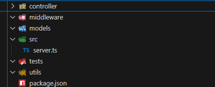
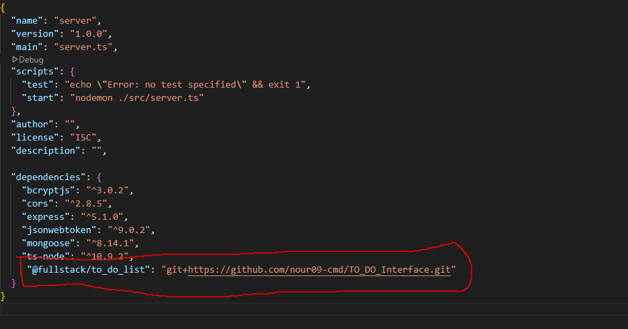

# 📝 TO-DO-LISTE

Dieses Projekt zeigt, wie man eine einfache TO-DO-Liste als Full-Stack-Anwendung erstellt – von der Planung über die Backend- und Datenbank-Implementierung bis hin zum Einsatz von Docker.

## 🚀 Ziel

Entwicklung einer benutzerfreundlichen Webanwendung, mit der registrierte Benutzer ihre Aufgaben verwalten können.  
Funktionen: Registrierung, Login, Erstellen, Lesen, Aktualisieren und Löschen von TO-DOs (CRUD).

---

## 🧩 Funktionen (User Stories)

- Als **registrierter Benutzer** möchte ich mich einloggen, um Zugriff auf meine TO-DOs zu erhalten.
- Als **angemeldeter Benutzer** möchte ich TO-DOs **erstellen**, um meine Aufgaben zu planen.
- Als **angemeldeter Benutzer** möchte ich TO-DOs **anzeigen**, um meine Aufgaben zu überblicken.
- Als **angemeldeter Benutzer** möchte ich TO-DOs **bearbeiten**, um Änderungen vornehmen zu können.
- Als **angemeldeter Benutzer** möchte ich TO-DOs **löschen**, um abgeschlossene Aufgaben zu entfernen.

---

## 🧪 Projekt lokal testen

### Voraussetzungen

- Docker installiert und gestartet
- Node.js installiert
- Kein laufender MongoDB-Container auf Port 27017

### 🛠️ Setup-Schritte

1. **Datenbank-URL konfigurieren**  
   Sicherstellen, dass `server/utils/config.ts` enthält:

```ts
   export const DB_URIMONGODB = "mongodb://localhost:27017/";
```

### MongoDB-Container starten

Im Terminal ausführen:

```bash
   docker run -d -p 27017:27017 --name mongodb -v mongodb_volume:/data/db mongo:latest
```

### Backend-Server starten

Im ``server``-Verzeichnis ausführen:

```bash
npm start
```

## 🐳 Projekt auf Docker testen

**Voraussetzungen:**

- Docker installiert
- Ports 27017/4545 frei

**Schritte:**

1. `docker compose up` ausführen
2. DB-URL in `server/utils/config.ts` prüfen

**Hinweis:**

- Backend unter localhost:4545 erreichbar
- Logs bei Fehlern checken
**Wichtig:**  
In `server/utils/config.ts` muss folgende DB-URL stehen:

```ts
export const DB_URIMONGODB = "mongodb://mongodb:27017/test";
```

### #Container starten

Im Terminal ausführen:

```bash
docker compose up --build
```

## 🛠️ POSTMANN `TODO_LIST.postman_collection.json`

1. Importiere die Datei `TODO_LIST.postman_collection.json`
2. Erstelle folgende Variablen in Postman:
   - **URL**: `http://localhost:4545/api`
   - **TOKEN**: `!deine_tokenkey`

### API Endpoints

#### Authentifizierung

- `POST {{URL}}/auth/register`  
- `POST {{URL}}/auth/login`

#### Tasks (Benötigt `Authorization: {{TOKEN}}` im Header)

- `POST {{URL}}/tasks/:email/tasks` - Task erstellen  
- `GET {{URL}}/tasks/:email/tasks` - Alle Tasks abrufen  
- `GET {{URL}}/:email/tasks/:taskId` - Task per ID abrufen  
- `POST {{URL}}/:email/tasks/:taskId` - Task aktualisieren  
- `DELETE {{URL}}/:email/tasks/:taskId` - Task löschen  

**Hinweis**: Ersetze `:email` und `:taskId` mit tatsächlichen Werten.

## 🧠 Schritt 1: Modellierung

### 📌 Use-Case-Diagramm 


### 📌 ER-Diagramm


---

## 🧠 Schritt 2: Setup environment

<div style="background-color: #f8d7da; border-left: 5px solid #f44336; padding: 10px; color: #721c24;">
  <strong>Hinweis:</strong><br>
  - Stellen Sie sicher, dass Node.js auf Ihrem PC installiert ist.<br>
  - Installieren Sie auch Docker auf Ihrem Computer.<br>
  - Wählen Sie einen Texteditor Ihrer Wahl (z. B. VS Code).<br>
  - ( OPTIONAL* ) Installieren Sie Git Bash
</div>

### 📌 Docker-Setup

1. Öffnen Sie Docker.
2. Öffnen Sie das Terminal (CMD) und starten Sie einen MongoDB-Container mit folgendem Befehl:

   ```bash
   docker run -d -p 27017:27017 --name mongo -v mongodb_volume:/data/db mongo:latest
   ```

    **testen**: auf

    ```bash
    http://localhost:27017/
    ```

,

### 📌 Implementiern sie interface classes

#### 📁 Schritt 1: Ordnerstruktur erstellen

1. Erstelle einen Ordner namens **`Interface`**.
2. Führe im `Interface`-Ordner den folgenden Befehl aus, um ein neues Node.js-Projekt zu initialisieren:

    ```bash
        npm init
    ```

3. Erstelle im Interface-Ordner eine Datei tsconfig.json mit folgendem Inhalt

    ```json
            {
                "compilerOptions": {
                "declaration": true,
                "module": "CommonJS",
                "target": "ES2020",
                "outDir": "./dist",
                "strict": true
                },
                "include": ["lib/**/*"], 
                "exclude": ["dist"]
            }
    ```

4. Erstelle nun einen Unterordner namens ``lib``, in dem die Interfaces definiert werden.  
5. Interface-Dateien erstellen `Interface/lib/Tasks.interface.ts`

    ```ts
            export interface ITasks {
                _id?: any;
                title:string;
                discription:string;
                dueDate:string;
                isCompleted: boolean;
            }
    ```

6. Interface-Dateien erstellen `Interface/lib/User.interface.ts`

    ```ts
                import { ITasks } from "./Tasks.interface";

                    export interface IUser {
                    name:string;
                    email:string;
                    password:string;
                    tasks: ITasks[]
                }
    ```

7. Interface-Dateien erstellen `Interface/index.ts`

    ```ts
        export * from "./lib/User.interface";
        export * from "./lib/Tasks.interface";
    ```

## ⚙️ Server Setup

### 📁  Server-Ordner erstellen

Erstelle einen Ordner namens **`server`**.

## ⚙️ Initialisiere das Projekt

Führe im Terminal im `server`-Ordner folgenden Befehl aus:
 `npm init`

## 🛠️ Lege folgende Struktur an, um eine saubere Trennung und Organisation im Backend zu gewährleisten



## 📄  ``package.json`` Nodemon-Script in package.json

**Zweck:**

- Automatischer Server-Neustart bei Code-Änderungen
- Entwicklerfreundlicher Workflow

**Vorteile:**

- Kein manueller Neustart nötig
- Sofortige Änderungsüberwachung
- Zeitersparnis während der Entwicklung

**Funktion:**

- `nodemon` überwacht alle Dateien
- Bei Änderungen: Server wird automatisch reloaded
- Fehler werden im Terminal angezeigt

``"start": "nodemon ./src/server.ts"``
  
   ```json
    {
    "name": "server",
    "version": "1.0.0",
    "main": "server.ts",
    "scripts": {
        "test": "echo \"Error: no test specified\" && exit 1",
        "start": "nodemon ./src/server.ts" 
    },
    "author": "",
    "license": "ISC",
    "description": ""
    }
   ```

## ⚙️  TypeScript-Konfiguration (`tsconfig.json`)

### Wichtige Einstellungen

1. **Compiler-Optionen**:
   - `"target": "ES6"` - Kompiliert zu modernem JavaScript
   - `"module": "commonjs"` - Für Node.js-Kompatibilität
   - `"outDir": "dist/src"` - Ausgabeordner für kompilierte Dateien

2. **Entwicklungsfeatures**:
   - `"sourceMap": true` - Ermöglicht Debugging
   - `"esModuleInterop": true` - Bessere Modul-Handhabung
   - `"experimentalDecorators": true` - Unterstützung für Decorators

3. **Optimierungen**:
   - `"incremental": true` - Schnellere Kompilierung
   - `"skipLibCheck": true` - Überspringt Bibliothekschecks
   - `"strictNullChecks": true` - Striktere Null-Prüfungen

Erstelle im ``server``-Ordner eine Datei mit dem Namen ``tsconfig.json`` und folgendem Inhalt:

   ```json
    {
    "compilerOptions": {
        "module": "commonjs",
        "target": "ES6",
        "moduleResolution": "node",
        "outDir": "dist/src",
        "esModuleInterop": true,
        "sourceMap": true,
        "emitDecoratorMetadata": true,
        "experimentalDecorators": true,
        "useDefineForClassFields": false,
        "incremental": true,
        "skipLibCheck": true,
        "declaration": false,
        "removeComments": true,
        "strictNullChecks": true,
        "allowSyntheticDefaultImports": true,
        "resolveJsonModule": true,
        "baseUrl": "./",
        "typeRoots": ["node_modules/@types"],
        "types": ["jest", "node"]
    },
    "lib": ["es2015"],
    "exclude": ["node_modules"]
    }
   ```

## ✅  Implementieren der Datei `src/server.ts`

### Kernkomponenten

1. **Express Setup**
   - Erstellt Express-App Instanz
   - Aktiviert JSON-Parsing Middleware
   - Fügt CORS-Unterstützung hinzu

2. **Basis-Route**:
   - GET `/` - Health-Check Endpunkt
   - Gibt einfache Begrüßung zurück

3. **Server-Start**:
   - Hört auf konfigurierten Port
   - Loggt Server-URL bei Start

### Wichtige Imports

- `express`: Web Application Framework
- `cors`: Cross-Origin Resource Sharing
- `PORT`: Konfigurationsvariable

### Funktionsweise

1. Initialisiert Express-Server
2. Konfiguriert Middlewares
3. Definiert Testroute
4. Startet Server auf spezifiziertem Port

Erstellen Sie die Datei `src/server.ts` mit folgendem Inhalt:

   ```ts
        import express, { Request, Response } from "express";
        import { PORT } from "../utils/conifg"; # ->../utils/conifg.ts muss auch eingefügt werden 

        const cors = require("cors");

        const app = express();

        app.use(express.json());
        app.use(cors());


        app.get("/", (req: Request, res: Response) => {
            res.send("Hello, From our backend");
        });


        app.listen(PORT, () => {
            console.log(`Server is running at http://localhost:${PORT}`);
        });
   ```

## ⚙️  Erstellen der Datei ``utils/config.ts``

Erstelle eine Datei ``utils/config.ts`` mit folgendem Inhalt, um den Port zentral zu verwalten:

```ts
export const PORT = 4545;
```

## ⚙️  Paketinstallation

### Wichtige Bibliotheken

1. **Express.js** (`express`)
   - Web-Framework für Node.js
   - Ermöglicht Routing und Middlewares

2. **Datenbank** (`mongoose`)
   - MongoDB-ODM (Object Data Modeling)
   - Vereinfacht Datenbankinteraktionen

3. **Sicherheit** (`cors`, `bcryptjs`, `jsonwebtoken`)
   - `cors`: Cross-Origin Resource Sharing
   - `bcryptjs`: Passwort-Hashing
   - `jsonwebtoken`: Authentifizierungstokens

4. **TypeScript** (`ts-node`)
   - Direkte Ausführung von TypeScript
   - Keine manuelle Kompilierung nötig
Führe im Terminal folgenden Befehl aus, um die benötigten Pakete zu installieren:

```bash
npm install cors express mongoose ts-node bcryptjs jsonwebtoken 
```

## 📌 Hinweis zur Verwendung von Nodemon

<div style="background-color: #f8d7da; border-left: 5px solid #f44336; padding: 10px; color: #721c24;">
  <strong>Hinweis:</strong><br>
  - Wenn du <strong>nodemon</strong> noch nicht installiert hast, kannst du es global installieren mit:<br>

```bash
npm install -g nodemon 
```

</div>

## 🧪  Server starten

Öffne dein Terminal und navigiere in das Verzeichnis ``server``. Starte den Backend-Server mit:

```bash
npm start
```

## 📦 MongoDB Connection

Diese Datei (`utils/mongoDBconnection.ts`) stellt eine Verbindung zur MongoDB-Datenbank her.

### 🛠 Funktionsweise

1. **Verbindung aufbauen**:
   - Die Klasse `DatabaseConnection` kümmert sich um die Verbindung zur MongoDB.
   - Sie verwendet die URI aus `DB_URIMONGODB` (definiert in `utils/config.ts`).

2. **Wichtige Methoden**:
   - `connect()`: Stellt die Verbindung zur Datenbank her.
   - `disconnect()`: Trennt die Verbindung zur Datenbank.

3. **Fehlerbehandlung**:
   - Falls etwas schiefgeht (z.B. falsche URI oder Verbindungsprobleme), wird eine Fehlermeldung ausgegeben und das Programm beendet.
erstellen `utils/mongoDBconnection.ts`

```ts
    import mongoose from "mongoose";
    import { DB_URIMONGODB } from "./conifg"; # ->../utils/conifg.ts muss auch eingefügt werden

    export class DatabaseConnection {
    private dbUri: string;

    constructor() {
        this.dbUri = DB_URIMONGODB || "";
        if (!this.dbUri) {
        console.error("Database URI not found in environment variables");
        process.exit(1);
        }
    }

    public async connect(): Promise<void> {
        try {
        const conn = await mongoose.connect(this.dbUri);

        console.log(`Database Connected: ${conn.connection.host}`);
        } catch (err) {
        console.error(`Database Error: ${(err as Error).message}`);
        process.exit(1);
        }
    }
    public async disconnect(): Promise<void> {
        try {
        await mongoose.disconnect();
        console.log(`Database disconnect`);
        } catch (err) {
        console.error(`Database Error: ${(err as Error).message}`);
        process.exit(1);
        }
    }
    }

    export default DatabaseConnection;
```

### 🔧 Konfiguration

Die MongoDB-URI wird in `utils/config.ts` festgelegt: ``DB_URIMONGODB``

```ts
export const DB_URIMONGODB = "mongodb://localhost:27017/";
```

## 📦 Add Submodule Interfaces to Server (TODO)



**Hinweis:** Dies ist nur eine mögliche Lösung – es gibt mehrere alternative Ansätze.

### Installation

1. Forken Sie das Projekt in Ihren eigenen GitHub-Account
2. Fügen Sie die Abhängigkeit in Ihrer `package.json` hinzu:

```bash
"@fullstack/to_do_list": "git+https://github.com/nour09-cmd/TO_DO_Interface.git"
```

## 📦 Models

### 1. Tasks Schema (`Tasks.schema.ts`)

- Definiert das Mongoose-Schema für Aufgaben
- Importiert das `ITasks` Interface
- Enthält Felder:
  - `title` (String, pflicht)
  - `description` (String, pflicht)
  - `dueDate` (String, pflicht)
  - `isCompleted` (Boolean, pflicht)

```ts
import { Schema } from "mongoose";
import {ITasks} from '@fullstack/to_do_list';


export const TasksSchema = new Schema<ITasks>({
    title: { type: String, required: true },
    discription: { type: String, required: true },
    dueDate: { type: String, required: true },
    isCompleted: { type: Boolean, required: true },
  });
```

### 2. User Schema (`User.schema.ts`)

- Definiert das Mongoose-Schema für Benutzer
- Importiert das `IUser` Interface und `TasksSchema`
- Enthält Felder:
  - `name` (String, pflicht)
  - `email` (String, pflicht)
  - `password` (String, pflicht)
  - `tasks` (Array von Tasks, optional)

```ts
import { Schema } from "mongoose";
import {IUser} from '@fullstack/to_do_list';
import {TasksSchema} from  "./Tasks.schema";

export const UsersSchema = new Schema<IUser>({
    name: { type: String, required: true },
    email: { type: String, required: true },
    password: { type: String, required: true },
    tasks: { type: [TasksSchema], required: false },
  });
```

### 3. User-Tasks Model (`User_Tasks.model.ts`)

- Implementiert CRUD-Operationen
- Aufbau:
  - **Klassenstruktur**:
    - Privates `model` (Mongoose Model)
    - Privates `conn` (Datenbankverbindung)
    - Constructor initialisiert Model

  - **Methoden**:
    - `createUser()`: Erstellt neuen Benutzer
    - `getUserByEmail()`: Findet Benutzer per E-Mail
    - `createTaskForUser()`: Fügt Task hinzu
    - `updateTaskForUser()`: Aktualisiert Task
    - `deleteTaskForUser()`: Löscht Task
    - `getTasksForUser()`: Holt alle Tasks eines Users
    - `getTaskByIdForUser()`: Holt spezifischen Task

- **Datenbankhandling**:
  - Jede Methode verbindet/trennt Verbindung
  - Nutzt Mongoose-Operationen:
    - `findOne`
    - `findOneAndUpdate`
    - `$push`, `$set`, `$pull` Operatoren
    - `lean()` für bessere Performance

```ts
import mongoose, { Schema, Model } from "mongoose";
import DatabaseConnection from "../utils/mongoDBconnection";
import { ITasks, IUser } from "@fullstack/to_do_list";
import { UsersSchema } from "./Users.schema";

export class User_Tasks_Model {
  private model: Model<IUser>;
  private conn: DatabaseConnection;

  constructor() {
    this.conn = new DatabaseConnection();
    this.model =
      (mongoose.models.UserProfile as Model<IUser>) ||
      mongoose.model<IUser>("UserProfile", UsersSchema);
  }

  async createUser(userData: Omit<IUser, "tasks">): Promise<IUser> {
    await this.conn.connect();
    const user = new this.model({ ...userData, tasks: [] });
    await this.conn.disconnect();

    return (await user.save()).toObject();
  }

  async getUserByEmail(email: string): Promise<IUser | null> {
    await this.conn.connect();
    const data = this.model.findOne({ email }).lean().exec();
    await this.conn.disconnect();
    return data;
  }

  async createTaskForUser(
    email: string,
    taskData: ITasks
  ): Promise<IUser | null> {
    await this.conn.connect();
    const data = this.model
      .findOneAndUpdate(
        { email },
        { $push: { tasks: taskData } },
        { new: true }
      )
      .lean()
      .exec();
    await this.conn.disconnect();

    return data;
  }

  async updateTaskForUser(
    email: string,
    taskId: string,
    updates: Partial<ITasks>
  ): Promise<IUser | null> {
    await this.conn.connect();
    const data = this.model
      .findOneAndUpdate(
        { email, "tasks._id": taskId },
        { $set: { "tasks.$": updates } },
        { new: true }
      )
      .lean()
      .exec();
    await this.conn.disconnect();
    return data;
  }

  async deleteTaskForUser(
    email: string,
    taskId: string
  ): Promise<IUser | null> {
    await this.conn.connect();
    const data = this.model
      .findOneAndUpdate(
        { email },
        { $pull: { tasks: { _id: taskId } } },
        { new: true }
      )
      .lean()
      .exec();
    await this.conn.disconnect();

    return data;
  }

  async getTasksForUser(email: string): Promise<ITasks[] | null> {
    await this.conn.connect();
    const user = await this.model
      .findOne({ email })
      .select("tasks")
      .lean()
      .exec();
    await this.conn.disconnect();

    return user?.tasks || null;
  }

  async getTaskByIdForUser(
    email: string,
    taskId: string
  ): Promise<ITasks | null> {
    await this.conn.connect();
    const user = await this.model
      .findOne({ email })
      .select("tasks")
      .lean()
      .exec();
    await this.conn.disconnect();
    return user?.tasks.find((task) => task._id?.toString() === taskId) || null;
  }
}
```

## 📦 Controllers

### 1. UserRegisterController (`UserRegister.controller.ts`)

- Handelt Benutzerregistrierung
- **Methoden**:
  - `createToken()`: Generiert JWT Token
  - `signUp()`: 
    - Validiert Eingabedaten
    - Prüft ob Benutzer existiert
    - Hasht Passwort (bcrypt)
    - Erstellt neuen Benutzer
    - Generiert Token

```ts
import { Request, Response } from "express";
import bcrypt from "bcryptjs";
import jwt from "jsonwebtoken";
import { SECRET_KEY, sendResponse } from "../utils/conifg";
import { User_Tasks_Model } from "../models/User_Tasks.model";

export class UserRegisterController {
    private userModel: User_Tasks_Model;

    constructor() {
        this.userModel = new User_Tasks_Model();
    }

    private createToken(email: string, name: string): string {
        return jwt.sign({ name, email }, SECRET_KEY, {
            expiresIn: "5h",
        });
    }

    async signUp(req: Request, res: Response) {
        try {

            const { name, email, password } = req.body;

            if (!name || !email || !password) {
                return sendResponse(res, 400, { error: "Name, email and password are required" });
            }
            const existingUser = await this.userModel.getUserByEmail(email);
            if (existingUser) {
                return sendResponse(res, 409, { error: "User already exists" });
            }

            const hashedPassword = await bcrypt.hash(password, 12);

            const newUser = await this.userModel.createUser({
                name,
                email,
                password: hashedPassword
            });

            const token = this.createToken(newUser.email, newUser.name);

            return sendResponse(res, 201, {
                token,
                user: {
                    name: newUser.name,
                    email: newUser.email
                }
            });
        } catch (error) {
            console.error("Signup error:", error);
            return sendResponse(res, 500, { error: "Internal server error" });
        }
    }
}

export default UserRegisterController;
```

### 2. UserLoginController (`UserLogin.controller.ts`)

- Handelt Benutzeranmeldung
- **Methoden**:
  - `createToken()`: Generiert JWT Token
  - `login()`:
    - Validiert Eingabedaten
    - Prüft Benutzer existenz
    - Vergleicht Passwort-Hashes
    - Generiert Token bei Erfolg

```ts
import { Request, Response } from "express";
import bcrypt from "bcryptjs";
import jwt from "jsonwebtoken";
import { SECRET_KEY, sendResponse } from "../utils/conifg";
import { User_Tasks_Model } from "../models/User_Tasks.model"; 

export class UserLoginController {
    private userModel: User_Tasks_Model;

    constructor() {
        this.userModel = new User_Tasks_Model();
    }

    private createToken(email: string, name: string): string {
        return jwt.sign({ name, email }, SECRET_KEY, {
            expiresIn: "5h",
        });
    }

    async login(req: Request, res: Response) {
        try {
            const { email, password } = req.body;

            if (!email || !password) {
                return sendResponse(res, 400, { error: "Email and password are required" });
            }

            const user = await this.userModel.getUserByEmail(email);
            if (!user) {
                return sendResponse(res, 401, { error: "Invalid credentials" });
            }

            const isPasswordValid = await bcrypt.compare(password, user.password);
            if (!isPasswordValid) {
                return sendResponse(res, 401, { error: "Invalid credentials" });
            }

            const token = this.createToken(user.email, user.name);
            
            return sendResponse(res, 200, {
                token,
                user: {
                    name: user.name,
                    email: user.email
                }
            });
        } catch (error) {
            console.error("Login error:", error);
            return sendResponse(res, 500, { error: "Internal server error" });
        }
    }
}

export default UserLoginController;
```

### 3. TasksController (`Tasks.controller.ts`)

- Handelt Task-Operationen
- **Hilfsmethode**:
  - `isDuplicateTask()`: Prüft auf doppelte Tasks

- **Task-Methoden**:
  - `createTask()`:
    - Validiert Eingaben
    - Prüft auf Duplikate
    - Erstellt Task mit ID
  - `getAllTasks()`:
    - Holt alle Tasks eines Benutzers
  - `getTaskById()`:
    - Holt spezifischen Task
  - `updateTask()`:
    - Aktualisiert Task-Daten
  - `deleteTask()`:
    - Löscht Task

- **Allgemein**:
  - Nutzt `sendResponse` für konsistente Antworten
  - Fehlerbehandlung mit try-catch
  - Statuscodes für verschiedene Szenarien

```ts
import { Request, Response } from "express";
import { sendResponse } from "../utils/conifg";
import { User_Tasks_Model } from "../models/User_Tasks.model";
import mongoose from "mongoose";

export class TasksController {
    private userModel: User_Tasks_Model;

    constructor() {
        this.userModel = new User_Tasks_Model();
    }

    private isDuplicateTask(tasks: any[], newTask: any): boolean {
        return tasks.some(task => 
            task.title === newTask.title && 
            task.description === newTask.description &&
            new Date(task.dueDate).getTime() === new Date(newTask.dueDate).getTime()
        );
    }

    async createTask(req: Request, res: Response) {
        try {
            const { email } = req.params;
            const taskData = req.body;

            if (!email || !taskData.title) {
                return sendResponse(res, 400, { error: "Email and task title are required" });
            }

            const user = await this.userModel.getUserByEmail(email);
            if (!user) {
                return sendResponse(res, 404, { error: "User not found" });
            }

            if (this.isDuplicateTask(user.tasks, taskData)) {
                return sendResponse(res, 409, { error: "Task already exists" });
            }

            const taskWithId = {
                ...taskData,
                _id: new mongoose.Types.ObjectId(),
                dueDate: taskData.dueDate || new Date(),
                isCompleted: taskData.isCompleted || false
            };

            const updatedUser = await this.userModel.createTaskForUser(email, taskWithId);

            return sendResponse(res, 201, {
                task: taskWithId
            });
        } catch (error) {
            console.error("Create task error:", error);
            return sendResponse(res, 500, { error: "Internal server error" });
        }
    }

    async getAllTasks(req: Request, res: Response) {
        try {
            const { email } = req.params;

            if (!email) {
                return sendResponse(res, 400, { error: "Email is required" });
            }

            const tasks = await this.userModel.getTasksForUser(email);

            return sendResponse(res, 200, {
                tasks: tasks || []
            });
        } catch (error) {
            console.error("Get tasks error:", error);
            return sendResponse(res, 500, { error: "Internal server error" });
        }
    }

    async getTaskById(req: Request, res: Response) {
        try {
            const { email, taskId } = req.params;

            if (!email || !taskId) {
                return sendResponse(res, 400, { error: "Email and task ID are required" });
            }

            const task = await this.userModel.getTaskByIdForUser(email, taskId);

            if (!task) {
                return sendResponse(res, 404, { error: "Task not found" });
            }

            return sendResponse(res, 200, {
                task
            });
        } catch (error) {
            console.error("Get task error:", error);
            return sendResponse(res, 500, { error: "Internal server error" });
        }
    }

    async updateTask(req: Request, res: Response) {
        try {
            const { email, taskId } = req.params;
            const updates = req.body;

            if (!email || !taskId) {
                return sendResponse(res, 400, { error: "Email and task ID are required" });
            }

            const existingTask = await this.userModel.getTaskByIdForUser(email, taskId);
            if (!existingTask) {
                return sendResponse(res, 404, { error: "Task not found" });
            }

            const updatedUser = await this.userModel.updateTaskForUser(
                email,
                taskId,
                {
                    ...existingTask,
                    ...updates,
                    dueDate: updates.dueDate || existingTask.dueDate
                }
            );

            if (!updatedUser) {
                return sendResponse(res, 404, { error: "User not found" });
            }

            const updatedTask = updatedUser.tasks.find(t => t._id?.toString() === taskId);

            return sendResponse(res, 200, {
                task: updatedTask
            });
        } catch (error) {
            console.error("Update task error:", error);
            return sendResponse(res, 500, { error: "Internal server error" });
        }
    }

    async deleteTask(req: Request, res: Response) {
        try {
            const { email, taskId } = req.params;

            if (!email || !taskId) {
                return sendResponse(res, 400, { error: "Email and task ID are required" });
            }

            const existingTask = await this.userModel.getTaskByIdForUser(email, taskId);
            if (!existingTask) {
                return sendResponse(res, 404, { error: "Task not found" });
            }

            const updatedUser = await this.userModel.deleteTaskForUser(email, taskId);

            return sendResponse(res, 200, {
                message: "Task deleted successfully"
            });
        } catch (error) {
            console.error("Delete task error:", error);
            return sendResponse(res, 500, { error: "Internal server error" });
        }
    }
}

export default TasksController;
```

## 📦 Routes

### 1. Auth Route (`Auth.route.ts`)

- Definiert Authentifizierungs-Endpunkte
- **Router Setup**:
  - Initialisiert Express Router
  - Erstellt Instanzen von:
    - `UserLoginController`
    - `UserRegisterController`

- **Endpunkte**:
  - `POST /register`:
    - Leitet an `registerController.signUp()` weiter
    - Fehlerbehandlung mit 500 Statuscode

  - `POST /login`:
    - Leitet an `loginController.login()` weiter
    - Fehlerbehandlung mit 500 Statuscode

```ts
import { Request, Response, Router } from "express";
import UserLoginController from "../controller/UserLogin.controller";
import UserRegisterController from "../controller/UserRegister.controller";
import { sendResponse } from "../utils/conifg";

const router = Router();

const loginController = new UserLoginController();
const registerController = new UserRegisterController();

router.route("/register").post(async (req: Request, res: Response) => {
  try {
    registerController.signUp(req, res);
  } catch (error) {
    sendResponse(res, 500, error.message);
  }
});
router.route("/login").post(async (req: Request, res: Response) => {
  try {
    loginController.login(req, res);
  } catch (error) {
    sendResponse(res, 500, error.message);
  }
});

module.exports = router;
```

### 2. Tasks Route (`Tasks.route.ts`)

- Definiert Task-bezogene Endpunkte
- **Router Setup**:
  - Initialisiert Express Router
  - Erstellt Instanzen von:
    - `UserLoginController` (scheint redundant)
    - `UserRegisterController` (scheint redundant)

- **Endpunkte**:
  - (Anmerkung: Die gezeigte Implementierung ist identisch zur Auth Route und scheint unvollständig)
  - Eigentlich erwartet:
    - POST /tasks - Neue Aufgabe erstellen
    - GET /tasks - Alle Aufgaben holen
    - etc. (wie im TasksController definiert)

- **Allgemein**:
  - Nutzt `sendResponse` für konsistente Antworten
  - Try-Catch für Fehlerbehandlung
  - Exportiert Router für Server-Integration

```ts
import { Request, Response, Router } from "express";
import UserLoginController from "../controller/UserLogin.controller";
import UserRegisterController from "../controller/UserRegister.controller";
import { sendResponse } from "../utils/conifg";

const router = Router();

const loginController = new UserLoginController();
const registerController = new UserRegisterController();

router.route("/register").post(async (req: Request, res: Response) => {
  try {
    registerController.signUp(req, res);
  } catch (error) {
    sendResponse(res, 500, error.message);
  }
});
router.route("/login").post(async (req: Request, res: Response) => {
  try {
    loginController.login(req, res);
  } catch (error) {
    sendResponse(res, 500, error.message);
  }
});

module.exports = router;
```

## 📦 Server Configuration (`server.ts`) Route Integration Explanation

### Purpose

Integrates modular route files into the main Express server to enable API endpoint accessibility.

### Components

- **Authentication Routes** (`Auth.route.ts`)
  - Handles user login and registration endpoints
- **Task Routes** (`Tasks.route.ts`)
  - Manages all task-related operations

### Key Characteristics

1. **Import Method**
   - Uses CommonJS `require()` syntax
   - Relative paths from server location

2. **Variable Assignment**
   - `userRoute`: Stores authentication router
   - `tasksRoute`: Stores task management router

3. **Comment Note**
   - Indicates these are new API link endpoints

### Implementation Flow

These route objects are subsequently:
1. Mounted under specific base paths (`/api/auth`, `/api/tasks`)
2. Connected to Express application
3. Make controller methods accessible via HTTP requests

```ts
import express, { Request, Response } from "express";
import { PORT } from "../utils/conifg";

const cors = require("cors");

const app = express();

app.use(express.json());
app.use(cors());


app.get("/", (req: Request, res: Response) => {
    res.send("Hello, From our backend");
});

// routes
const userRoute = require("../route/Auth.route"); // -> die neue route (api links)
const tasksRoute = require("../route/Tasks.route");

app.use("/api/auth", userRoute);
app.use("/api/tasks", tasksRoute);

app.listen(PORT, () => {
    console.log(`Server is running at http://localhost:${PORT}`);
});
```

## 📦 Authentication Middleware

### Zweck

Überprüft JWT-Tokens zum Schutz von API-Routen

### Hauptfunktionen

- **Token-Überprüfung**:
  - Prüft den `Authorization`-Header
  - Verifiziert Token mit geheimen Schlüssel
  - Dekodiert Benutzerdaten (E-Mail/Name)

- **Benutzer-Validierung**:
  - Prüft Benutzerexistenz in der Datenbank
  - Fügt Benutzerdaten zum Request hinzu

- **Fehlerbehandlung**:
  - Status 401 bei fehlenden/ungültigen Tokens
  - Status 400 für ungültige Token-Formate

### Arbeitsablauf

1. Token aus Headern extrahieren
2. Token-Signatur verifizieren
3. Benutzerexistenz bestätigen
4. Zugriff auf geschützte Routen erlauben
5. Ungültige Anfragen blockieren

### Abhängigkeiten

- Verwendet JWT für Token-Verwaltung
- Nutzt `User_Tasks_Model`
- Erfordert `SECRET_KEY` aus Konfiguration

```ts
import { NextFunction, Request, Response } from "express";
import { SECRET_KEY } from "../utils/conifg";
import jwt from "jsonwebtoken";
import { User_Tasks_Model } from "../models/User_Tasks.model";


export class UserAuth{
     private userModel: User_Tasks_Model;
    
        constructor() {
            this.userModel = new User_Tasks_Model();
        }

      async authenticateToken(req: Request, res: Response, next: NextFunction) {
        const authHeader = req.header("Authorization");
        const token = authHeader;
    
        if (!token)
          return res
            .status(401)
            .send({ message: "Access denied. No token provided." });
    
        try {
          const decoded = jwt.verify(token, SECRET_KEY);
          const { name, email } = decoded;
          const user = await this.userModel.getUserByEmail(email);
          if (!user)
            return res
              .status(401)
              .send({ message: "Access denied. Invalid token." });
    
          req["user"] = { name, email };
    
          next();
        } catch (error) {
          return res.status(400).send({ message: "Invalid token" });
        }
      }

}
```

## 📦 Middleware-Einbindung in Routes

### Kurzerklärung

1. **Initialisierung**:
   - `new UserAuth()` erstellt Middleware-Instanz

2. **Anwendung**:
   - Wird als erstes Parameter in Route-Definition eingefügt
   - `.bind(userAuth)` sichert korrekten `this`-Kontext

3. **Funktionsweise**:
   - Prüft Token VOR Route-Handler
   - Bei Erfolg: Controller wird ausgeführt
   - Bei Fehler: Request wird blockiert

### Beispielroute

- Geschützter POST-Endpunkt für Tasks
- Kombiniert Auth + Task-Erstellung

```ts
const userAuth = new UserAuth(); // class abrufen
router.route("/:email/tasks").post(  
userAuth.authenticateToken.bind(userAuth), // her einfügen 
async (req: Request, res: Response) => {
  try {
    tasksController.createTask(req, res);
  } catch (error) {
    sendResponse(res, 500, error.message);
  }
});
```

## ⚙️ Dockerfile Konfiguration

### Dockerfile `server/Dockerfile`

### Grundlegende Funktionen

1. **Basis-./Diagramms/Image**
   - Nutzt Node.js Version 20
   - Enthält alle nötigen Laufzeitumgebungen

2. **Arbeitsverzeichnis**:
   - Legt `/app` als Arbeitsordner fest

3. **Dateikopie**:
   - Kopiert alle lokalen Dateien in den Container

4. **Paketinstallation**:
   - Installiert alle Abhängigkeiten via npm
   - `--force` überschreibt eventuelle Konflikte

5. **Portfreigabe**:
   - Macht Port 4545 für den Host verfügbar

6. **Startbefehl**:
   - Führt `npm start` beim Containerstart aus

```DockerFile
FROM node:20
WORKDIR /app
COPY . ./
RUN npm install --force
EXPOSE 4545
CMD [ "npm", "start" ]
```

### ``docker-compose.yml``

### Services

1. **MongoDB Service**:
   - Nutzt das offizielle MongoDB-./Diagramms/Image
   - Port 27017 für Datenbankzugriff
   - Im eigenen Netzwerk `app-network`

2. **Backend Service**:
   - Baut ./Diagramms/Image aus `./server`-Verzeichnis
   - Port 4545 für API-Zugriff
   - Startet erst nach MongoDB (`depends_on`)

### Netzwerk

- **Bridge-Netzwerk** (`app-network`)
  - Ermöglicht Kommunikation zwischen Containern
  - Isoliert von anderen Docker-Netzwerken

```yml
services:
  mongodb:
    ./Diagramms/image: mongo:latest
    container_name: mongodb
    ports:
      - "27017:27017"
    networks:
      - app-network
  backend:
    build: ./server
    ports:
      - "4545:4545"
    depends_on:
      - mongodb
    networks:
      - app-network
networks:
  app-network:
    driver: bridge
```

## 📚 Offizielle Dokumentationen & Nützliche Tools

### Backend-Entwicklung

| Technologie | Dokumentation | Beschreibung |
|-------------|---------------|--------------|
| **Node.js** | [Offizielle Docs](https://nodejs.org/en/docs/) | JavaScript-Laufzeitumgebung für Serverseitige Entwicklung |
| **TypeScript** | [TS Handbuch](https://www.typescriptlang.org/docs/) | Typisiertes JavaScript-Superset |

### Datenbanken

| Technologie | Dokumentation | Beschreibung |
|-------------|---------------|--------------|
| **MongoDB** | [MongoDB Docs](https://docs.mongodb.com/) | Dokumentenorientierte NoSQL-Datenbank |
| **PostgreSQL** | [PostgreSQL Docs](https://node-postgres.com/) | Open-Source RDBMS |

### Sicherheit

| Technologie | Dokumentation | Beschreibung |
|------------|---------------|--------------|
| **bcrypt** | [npm bcryptjs](https://www.npmjs.com/package/bcryptjs) | Passwort-Hashing Bibliothek |
| **JWT** | [jwt.io](https://jwt.io/introduction/) | JSON Web Tokens Standard |

### Infrastruktur

| Technologie | Dokumentation | Beschreibung |
|-------------|---------------|--------------|
| **Docker** | [Docker Docs](https://docs.docker.com/) | Container-Plattform |

### Frontend

| Technologie | Dokumentation | Beschreibung |
|-------------|---------------|--------------|
| **Angular** | [Angular Docs](https://angular.io/docs) | Web Application Framework |

### Projekt-Dokumentation

| Tool | Dokumentation | Beschreibung |
|------|---------------|--------------|
| **README.md** | [Markdown Guide](https://www.markdownguide.org/) | Standard für Projektbeschreibungen |

## 📜 Lizenz

Dieses Projekt ist lizenziert unter der [MIT-Lizenz](LICENSE).
